# Pertemuan 01 Instalasi Git Pada Windows

1. Langkah pertama download melalui link https://github.com/stmik-akakom/rtfm.
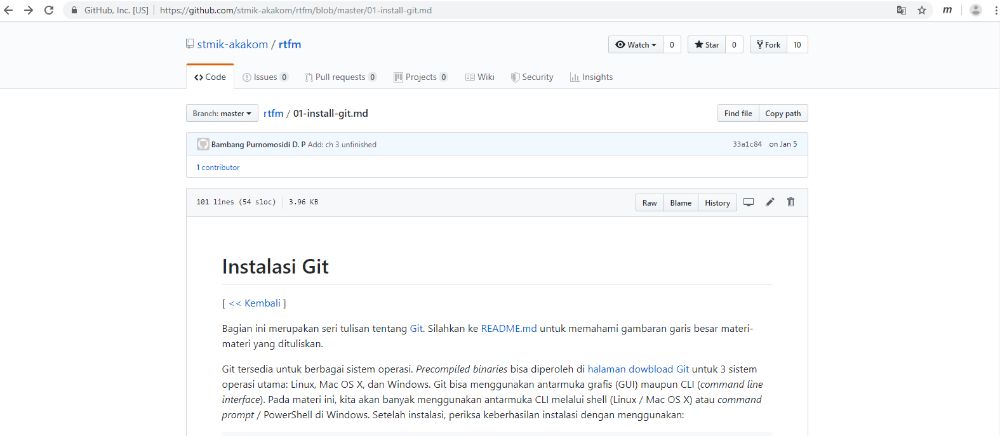

2. Setelah download, buka file tersebut untuk menjalankan proses instalasi. Ikuti semua instruksi. Maka akan muncul infomasi lisensi Git, klik Next > untuk melanjutkan.
   
   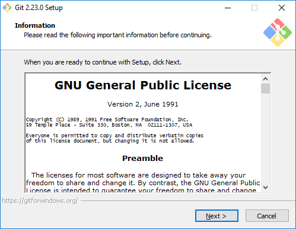

3. Selanjutnya pemilihan komoponen, biarkan saja seperti ini kemudian klik Next >.
   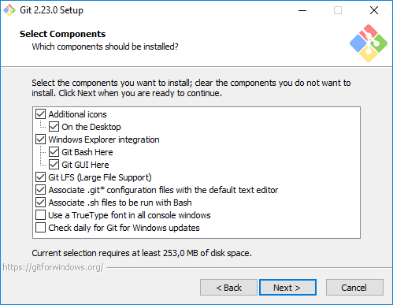 
   
4. Pilih editor untuk menggunakan Git nantinya. Lalu klik Next.

   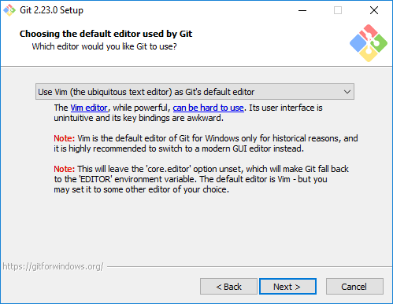
   
5. Selanjutnya pengaturan PATH Environment. Pilih yang tengah agar perintah git dapat di kenali di Command Prompt (CMD). Setelah itu klik Next >.
   
   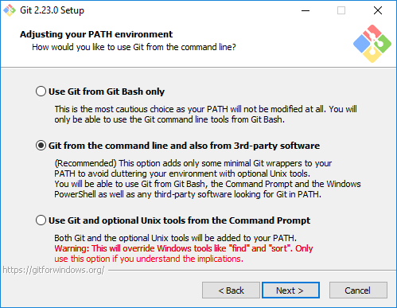
   
6. Memilih jenis koneksi ke server, lalu klik Next.
   
   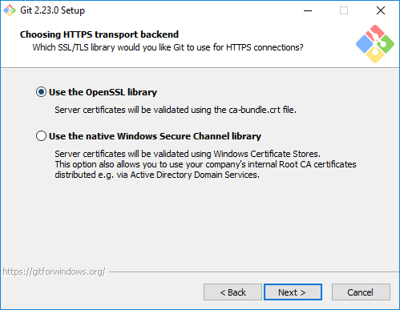

7. Mengatur baris akhir file teks nantinya, lalu klik Next.  
   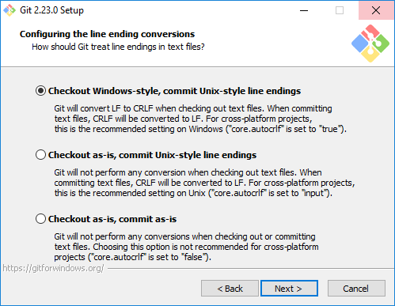
   
8. Mengatur terminal emulator yang akan digunakan dengan Git Bash. Pilih yang atas, kemudian klik Next >.
   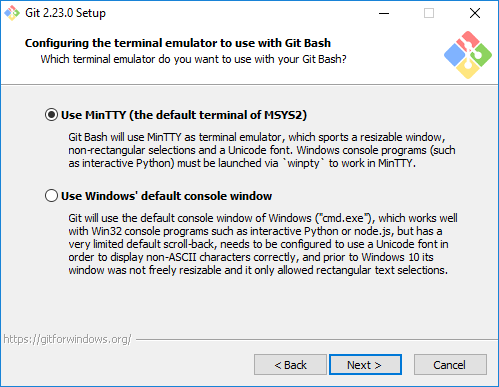
   
9. Memilih opsi tambahan yang mungkin diperlukat, lalu klik Next.
   
   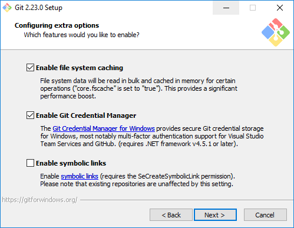
   
10. Selanjutnya pemilihan opsi ekspreimental, langsung saja klik Install untuk memaulai instalasi..
   
    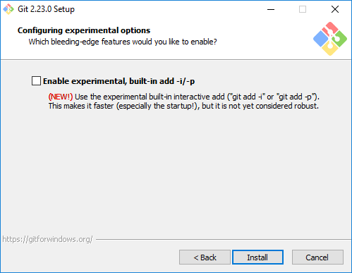
	
11. Tunggu beberapa saat, instalasi sedang dilakukan.
   
    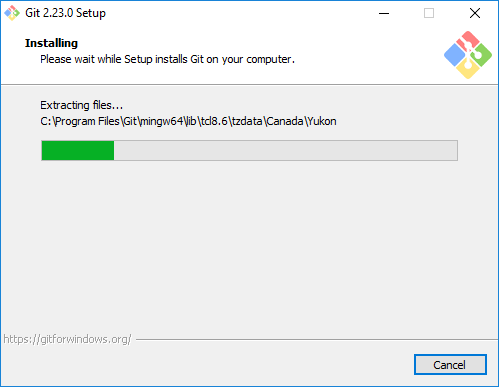
	
12. Setelah selesai, kita bisa langsung klik Finishh.
   
    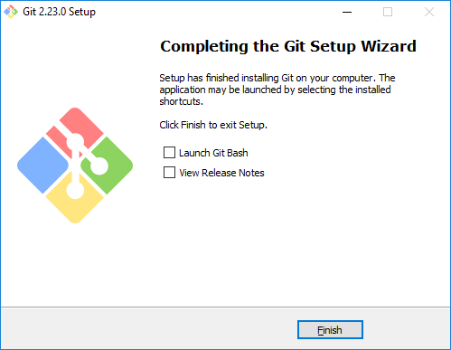
	
13. Berikut tampilan aplikasi Git Bashnya.
   
    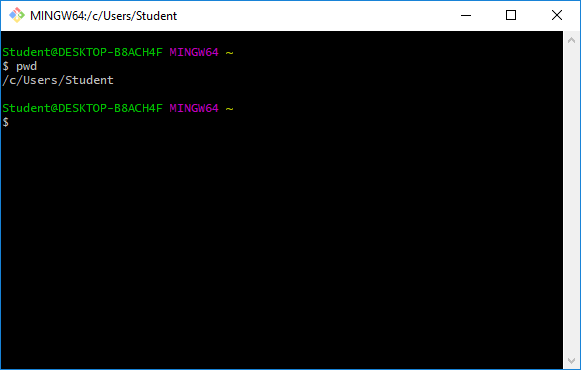