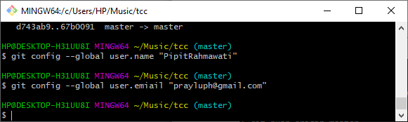
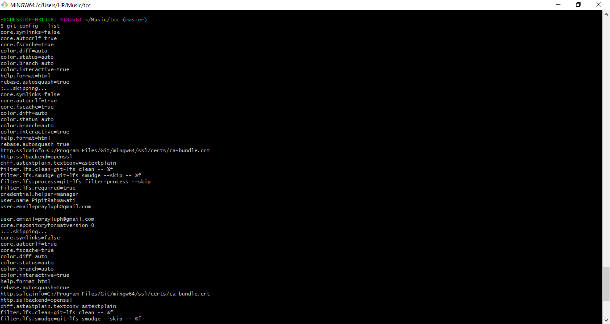
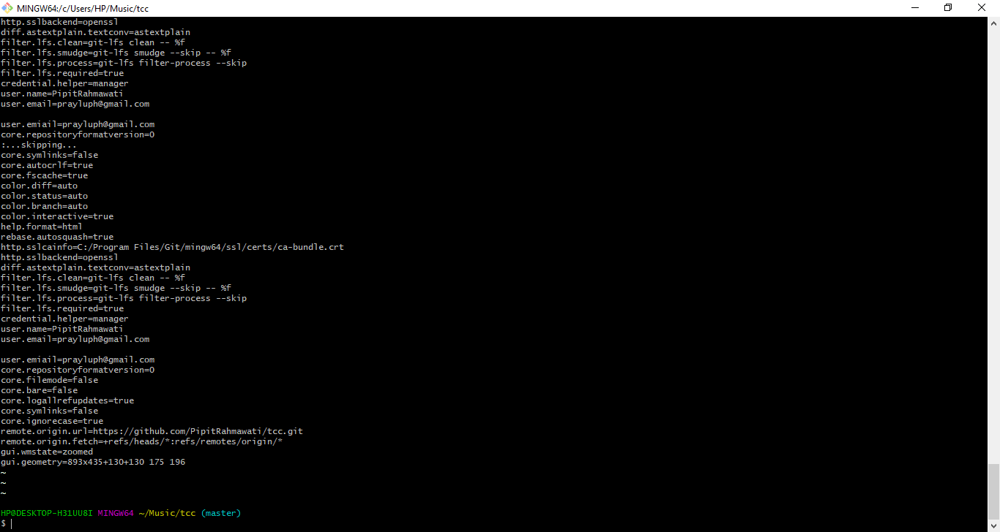

#Konfigurasi Git

Ada beberapa konfigurasi yang harus dupersiapakan sebelum mulai menggunakan Git, seperti name dan email.

Silahkan lakukan konfigurasi dengan perintah berikut ini.
1. 

Kemudian periksa konfigurasinya dengan perintah berikut :
kemudian akan tampil hasil configurasi berikut

2. 

3. 
