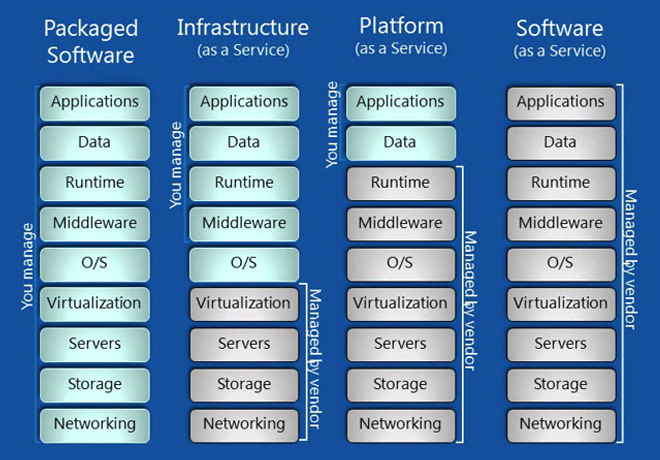

#SOFTWARE AS A SERVICE

Software as a service (SaaS) atau 'on-demand software' adalah aplikasi yang dihosting yang bisa diakses melalui internet menggunakan web browser.

Layer aplikasi cloud merupkan layer yang terlihat oleh pengguna/user. Pengguna berinteraksi melalui software yang dihosting via browser. 

Beberapa contoh aplikasi yang sudah ada :
1. Salesforce.com
2. Dropbox
3. Google Services
4. Prezi

