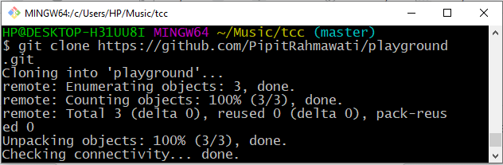
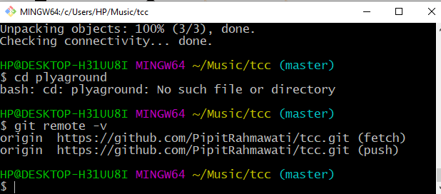
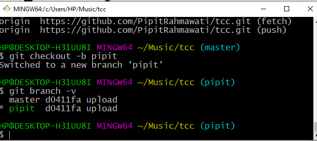

## PERTEMUAN MINGGU KE 10

## Kolaborasi 

Clone belajarfork terlebih dahulu kemudian masuk ke repo tersebut :

1. Login ke Github dan masuk ke repo fork, pilih fork

2. Lihat repository yang ada

3. Update dari upstream ke master dan buat branch dengan nama "pipit"

